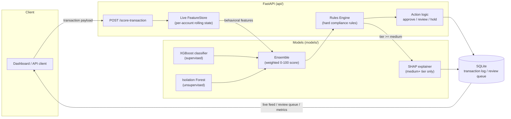

# Real-Time Transaction Risk Scoring Engine

An AI-powered fraud detection and compliance automation system for payment
transactions: a rolling behavioral feature store, a supervised + unsupervised
ML ensemble producing a 0-100 risk score, a compliance rules engine, SHAP
explainability, and a FastAPI + Streamlit stack you can run locally and demo
live.

## Architecture



**Pipeline stages:** `data/` (load + synthesize + split) -> `features/`
(rolling behavioral feature store, shared by training and serving) ->
`models/` (train supervised + anomaly detectors, combine into an ensemble,
explain via SHAP) -> `api/` (FastAPI serving layer: scoring, rules, actions,
SQLite log) -> `dashboard/` (Streamlit ops console).

## Repo layout

```
data/            Data loading, synthetic augmentation, preprocessing
features/        Rolling behavioral feature store (shared train + serve)
models/          Training scripts, ensemble, SHAP explainability, artifacts
api/             FastAPI serving layer: scoring, rules engine, actions, DB
dashboard/       Streamlit dashboard
notebooks/       EDA and model evaluation (Jupytext percent-format .py)
tests/           Unit + integration tests
scripts/         One-off utilities (synthetic data generator)
```

## Quickstart

### Option A: Docker (one command)

```bash
docker build -t risk-engine .
docker run -p 8000:8000 -p 8501:8501 risk-engine
```

The image generates a demo dataset and trains all models at build time, so
the container is immediately usable -- no Kaggle account required. Then open:

- API docs: http://localhost:8000/docs
- Dashboard: http://localhost:8501

### Option B: Local Python

```bash
pip install -r requirements.txt

# 1. Get data (either works):
python scripts/generate_synthetic_data.py --n-rows 250000   # no credentials needed
# -- or, with a real Kaggle API token configured --
python data/download_data.py

# 2. Build behavioral metadata + chronological train/test split
python data/preprocess.py

# 3. Train the supervised + anomaly models, evaluate the ensemble
python -m models.train_all

# 4. Run the API
python -m uvicorn api.main:app --reload --port 8000

# 5. In a second terminal, run the dashboard
streamlit run dashboard/app.py
```

### Tests

```bash
pytest tests/ -v
```

`test_feature_store.py` and `test_rules_engine.py` are pure unit tests with
no dependencies. `test_api.py` is skipped automatically until model artifacts
exist (run step 3 above first).

## Dataset & synthetic metadata

This project targets the Kaggle **Credit Card Fraud Detection** dataset
(`mlg-ulb/creditcardfraud`, 284,807 transactions, ~0.17% fraud). That dataset
ships `Time`, `Amount`, `Class`, and `V1..V28` -- 28 PCA-anonymized components
standing in for the bank's real (undisclosed) transaction features. It does
**not** include a card/account id, device id, or geolocation, which a
real-time behavioral feature store needs for velocity, new-device, and
new-geo features.

`data/preprocess.py` deterministically attaches synthetic
`account_id` / `device_id` / `geo_region` metadata on top of the real `Time`,
`Amount`, `V1..V28`, and `Class` columns (seeded, reproducible). Fraud rows
are given a markedly higher chance of using an unrecognized device
(65% vs. 6%) and an unusual geography (55% vs. 3%) than legitimate rows --
mirroring real account-takeover fraud -- so the behavioral features have
genuine signal to learn from rather than being pure noise. `notebooks/01_eda.py`
verifies this empirically (fraud shows ~46% new-geo rate vs. ~3% for legit in
this synthetic run). This is a disclosed, documented substitution, not an
attempt to pass synthetic data off as real fraud metadata.

`data/download_data.py` fetches the real dataset via the Kaggle API if you
have credentials configured (`~/.kaggle/kaggle.json` or `KAGGLE_USERNAME`
/ `KAGGLE_KEY`). Without credentials, `scripts/generate_synthetic_data.py`
generates a schema-compatible stand-in (same columns, same ~0.17% fraud rate,
a handful of components shifted for fraud rows to mirror the real, known
signal concentration in components like V14/V17/V12/V10) so the entire
pipeline is runnable and demoable with zero setup. Everything downstream --
preprocessing, feature engineering, training, serving -- only depends on the
column schema, not on which source produced the CSV, so swapping in the real
dataset is a one-line change.

## Core ML pipeline

### 1. Rolling behavioral feature store (`features/feature_store.py`)

Per account, computed causally (never using a transaction's own data to
compute its own features):

- `velocity_count_1m` / `_5m` / `_1h` -- transaction count in each window
- `amount_zscore` -- current amount vs. this account's own rolling mean/std
- `time_since_last_tx_sec`
- `is_new_device` / `is_new_geo` -- has this account ever used this device / been in this region before

The same `FeatureStore` class is used both to build training features (by
replaying historical data in chronological order) and to score live
transactions one at a time in the API. This closes the classic **train/serve
skew** gap by construction -- there's no second implementation that could
drift from the first.

### 2. Two models + an ensemble (`models/`)

- **Supervised: XGBoost** (`train_supervised.py`), tuned on precision-recall
  curves, not accuracy or ROC-AUC. Class imbalance handled via
  `scale_pos_weight` (class weighting) rather than SMOTE.
- **Unsupervised: Isolation Forest** (`train_anomaly.py`), fit only on
  transactions labeled legitimate, as a model of "normal" account behavior --
  a secondary signal for fraud typologies the supervised model never saw
  labeled examples of.
- **Ensemble** (`ensemble.py`): `risk_score = round(100 * (0.7 * supervised_prob + 0.3 * anomaly_score))`,
  mapped to a `low` / `medium` / `high` tier.

### 3. SHAP explainability (`models/explain.py`)

Computed only for transactions that clear the `medium` risk tier, so every
flagged transaction has an auditable "why" without paying SHAP's cost on the
~97%+ of traffic that's auto-approved.

## API (`api/`)

| Endpoint | Description |
|---|---|
| `POST /score-transaction` | Score one transaction: risk score, tier, action, rules triggered, SHAP explanation (if flagged), compliance alert (if high risk) |
| `GET /transactions/recent` | Live feed for the dashboard |
| `GET /review-queue` | Medium/high risk transactions awaiting review |
| `POST /review-queue/{id}/resolve` | Mark a queued transaction reviewed |
| `GET /metrics` | Precision / recall / F1 / FPR from the last training run |
| `POST /admin/reset-demo` | Clear the log + in-memory account state for a fresh demo |

A hard **rules engine** (`api/rules_engine.py`) sits on top of the ML score:
e.g. a large amount from a brand-new device forces the score to at least 95
regardless of what the model output. Rules only ever raise the score -- they
are a floor, never a ceiling, so a compliance control can't be silently
overridden by a model that happens to disagree.

**Actions:** `low` -> auto-approve · `medium` -> log for manual review ·
`high` -> auto-hold + compliance alert. All scored transactions are persisted
to a SQLite log (`api/db.py`) that backs both the live feed and the review
queue.

## Dashboard (`dashboard/app.py`)

A Streamlit console with three tabs:

- **Live Feed** -- recent scored transactions, color-coded by risk tier, with
  a "Replay next batch" / "Auto-replay" control that streams real transactions
  from the held-out test set through the live API to simulate real-time
  traffic.
- **Review Queue** -- medium/high risk transactions with their SHAP
  explanation rendered as a bar chart, and a "mark resolved" action.
- **Model Performance** -- precision, recall, F1, PR-AUC, false positive rate,
  and the risk-tier distribution, pulled live from `GET /metrics`.

## Architecture decisions

**Why an ensemble instead of one model?** The supervised model is precise
about fraud patterns it has labeled examples of, but structurally cannot
flag a fraud typology it's never seen -- it was never penalized for missing
it. The Isolation Forest doesn't need labels; it flags "this doesn't look
like this account's normal behavior" regardless of whether a similar fraud
example exists in training data. Blending them (0.7 / 0.3, supervised-
dominant) adds a second, independent signal for the cost of one extra cheap
inference call.

**Why a tiered 0-100 score instead of a binary flag?** A binary flag forces
identical handling on a transaction that's 51% likely fraud and one that's
99% likely fraud, and gives a compliance team no way to prioritize review.
Tiers let a cheap, reversible action (log for review) trigger at a lower bar
than an expensive, customer-visible one (auto-hold + alert) -- which is how
real payments risk systems are actually operated.

**Why SHAP only on flagged transactions?** TreeSHAP per row is cheap in
isolation but not free, and the overwhelming majority of traffic is
low-risk and auto-approved -- there's no compliance or customer reason to
explain a decision nobody will review. Gating it behind the risk tier means
only the transactions a human will actually look at pay the SHAP cost.

**How class imbalance was handled.** Fraud is <1% of transactions (this
project's synthetic data mirrors the real dataset's ~0.17% rate). We use
`scale_pos_weight` (class weighting) rather than SMOTE: SMOTE synthesizes new
fraud examples by interpolating between existing ones in feature space,
which is reasonable for a few dense numeric features but questionable in a
sparse, mostly-PCA'd 35-dimensional space, where an interpolated point may
not correspond to anything that could plausibly occur. `scale_pos_weight`
instead reweights the real examples we have -- cheaper, and it never invents
data. Model selection and threshold tuning both use precision-recall curves,
not accuracy or ROC-AUC, which stay deceptively good even for a model that's
bad at the precision/recall tradeoff that actually matters.

**Why a chronological train/test split, not random.** Fraud detection has to
be validated on data that comes *after* the training window, exactly as a
production model would see it. A random split lets a model implicitly learn
from "future" transactions on the same account that happen to land in the
training set, which overstates real-world performance.

## Known limitations / what changes in production

- The synthetic account/device/geo metadata is a documented stand-in, not
  real user data -- see "Dataset & synthetic metadata" above. Point
  `data/download_data.py` at the real dataset (or a real transaction feed)
  and nothing downstream needs to change.
- The synthetic dataset's fraud signal is deliberately strong (a handful of
  components are shifted 2.5-4.5 std devs for fraud rows), so the metrics
  you'll see on it (>95% precision/recall) are optimistic versus the real
  Kaggle dataset, where published baselines are typically in the 80-95%
  precision / 70-90% recall range depending on threshold. Swap in the real
  CSV to get realistic numbers.
- The live `FeatureStore` is in-process memory -- fine for a single API
  process in a demo; a production deployment would back it with a shared
  low-latency store (e.g. Redis) so account state is consistent across
  multiple API replicas.
- SQLite is used for the transaction log for zero-setup portability; a
  production deployment would use a proper OLTP database.
